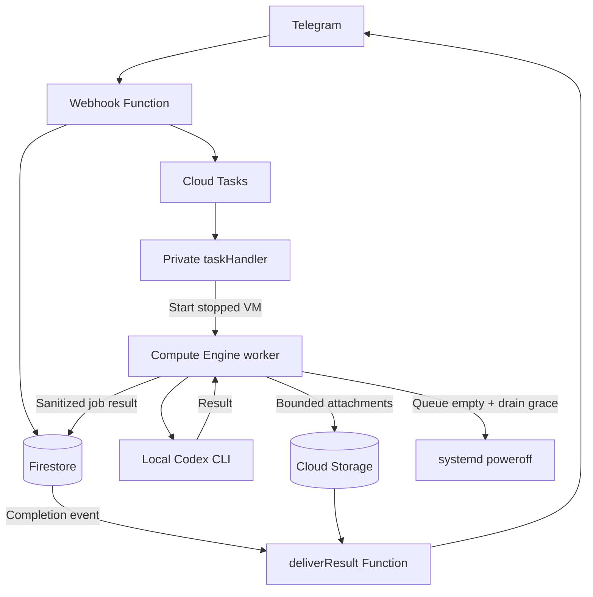

# Telegram Codex Scheduler — Google Cloud wake-to-run

> Private, self-hosted Telegram scheduler for the locally authenticated Codex CLI.
> Never put a Telegram token, Codex credential, Google refresh token, or service-account
> key in this repository.

I built this bot for my own personal use. I am exploring a commercial version for
a wider audience, where each user could sign in with their own Codex account and
use the bot independently. This is a future direction, not an available service.

## Main goal

The primary goal is to let you send a Codex instruction whenever you want from
your phone, without keeping your personal computer powered on 24/7. Telegram is
the remote control; a normally stopped cloud VM wakes only for the requested job,
runs Codex, returns the result to the phone, and shuts down again. This is
especially useful for banked Codex resets: from your phone, you can see how many
earned resets are available and when each one expires before using one to reset
the eligible 5-hour and weekly limits.

A primary use case is making the five-hour window work around your day instead
of arranging your day around it. For example, schedule a tiny Codex task such as
`say "hi"` for early morning, before you wake up. The cloud VM starts by itself,
runs the message, sends the result to Telegram, and powers off. You do not need
to wake up just to send the first message, configure cron on your personal
computer, or leave that computer running all night. When you later begin a
focused one- or two-hour work session, the active five-hour window is already
further along and can reset sooner than if your first message had been sent only
when you started working. Exact quotas and reset behavior still depend on the
current Codex plan shown in the app.

## Features

- **Run now or schedule:** button-based Telegram flow, time presets, custom dates,
  IANA timezones, and UTC storage. The quick actions start with `say "hi"`; use
  **Edit message** before confirmation for a custom instruction.
- **Choose the project and permissions:** select a configured directory on the VM;
  read-only is the default, and workspace writes require explicit confirmation.
- **Manage jobs:** paginated listings, cancellation before execution, and saved
  timezone, project, and output preferences.
- **Receive results:** sanitized previews or bounded file attachments in Telegram.
- **Check Codex status:** separate buttons for banked-reset counts and expiry dates,
  and for 5-hour/weekly usage windows, with remaining percentage shown first.
- **Wake only when needed:** the worker starts for queued work and shuts down after
  the queue drains, with an independent maximum-runtime watchdog.

## Architecture

**Stack:** TypeScript, Node.js 24, Telegraf, Firebase Functions Gen 2, Firestore,
Cloud Tasks, Compute Engine, Cloud Storage, Secret Manager, and systemd.



The serverless control plane accepts requests while the VM is stopped. Firestore
holds durable state; Cloud Tasks schedules authenticated wake requests without an
always-running polling service. The persistent VM disk keeps the worker checkout,
project folders, and local Codex login across stop/start cycles.

## Implementation walkthrough

The following sections follow a request from the Telegram interface to VM shutdown.
Code excerpts come from the current implementation, shortened where indicated;
linked source files contain the complete handlers and error paths.

### 1. Telegram menus and persistent drafts

[The Telegraf bot](apps/functions/src/telegramBot.ts) routes buttons and slash
commands to the same handlers. **Send say "hi" now** opens project selection;
**Schedule say "hi"** first asks for a time. Both prefill a small prompt, which the
user can replace through **Edit message** before confirming.

```ts
const QUICK_PROMPT = 'say "hi"';

bot.command("schedule", (ctx) => beginSchedule(ctx, dependencies));
bot.hears(MENU.schedule, (ctx) => beginSchedule(ctx, dependencies));
bot.command("run_now", (ctx) => beginRunNow(ctx, dependencies));
bot.hears(MENU.runNow, (ctx) => beginRunNow(ctx, dependencies));
```

Drafts live in Firestore with a `flow`, `step`, `payload`, revision, and expiry.
This lets separate webhook invocations resume the interaction without keeping
conversation state in Function memory. Each transition updates the draft in a
transaction; expired drafts are rejected on read. The default TTL is 30 minutes.

The scheduled flow is `select_time → select_directory → select_permission → confirm`.
Workspace-write inserts an additional acknowledgement step. Settings persist the
IANA timezone, default project, preview length, and preview/file output mode in
`users/{telegramUserId}`; new jobs snapshot their timezone and project selection.

### 2. Dates, project selection, and permissions

[The date parser](packages/shared/src/dateParser.ts) uses Luxon for explicit dates,
relative inputs such as `in 2 hours`, and local expressions such as `tomorrow 7am`.
It validates the timezone and requested time, then normalizes the result to UTC:

```ts
if (parsed.toMillis() <= now.getTime()) {
  return { ok: false, reason: "Please choose a time in the future." };
}
return { ok: true, date: parsed.toUTC().toJSDate() };
```

Project buttons submit a logical `workdirKey`, never an arbitrary server path.
The worker resolves that key against its root-owned configuration using
[WorkdirPolicy](apps/worker/src/pathPolicy.ts), verifies the real directory, and
rejects paths that escape the configured roots. A selected project is a folder on
the VM; it must be cloned and configured there before use.

Read-only is the default permission. Choosing workspace-write displays a warning
and requires an explicit acknowledgement before the final job confirmation.
The selected permission becomes the `--sandbox` argument passed to Codex.

### 3. Durable jobs and duplicate protection

Confirmation creates a Firestore job through
[createIdempotent](apps/functions/src/repositories/firestoreJobRepository.ts).
Each Telegram update has an operation document linked to its resulting job:

```ts
const operationId = `telegram-${telegramUpdateId}`;
const operationRef = this.firestore.collection("operations").doc(operationId);
const jobRef = this.firestore.collection("jobs").doc(id);
```

Inside one transaction, the repository checks that operation first. If it already
exists, it returns the linked job. Otherwise, it creates both records together.
This prevents a replay of the same update from creating another execution.
Immediate jobs start as `pending_wake`; scheduled jobs start as `scheduled`.

```text
scheduled -> pending_wake -> [starting] -> pending -> running -> completed / failed
```

[The shared state machine](packages/shared/src/jobStateMachine.ts) centralizes
allowed transitions. Jobs store their prompt, due time, project and permission,
lease owner, execution timestamps, exit code, sanitized preview, and delivery status.
Execution and notification delivery are separate lifecycles.

**My scheduled messages** lists the user's active execution jobs in pages of five,
excluding status checks. Cancellation verifies ownership and allows only
`scheduled`, `pending_wake`, or `pending` jobs. It records `cancelled` and removes
the stored wake task when present; the task handler also checks cancellation before
waking the VM. Running jobs cannot be interrupted through Telegram.

### 4. Scheduled wake-up and VM state handling

After job creation, [CloudTasksService](apps/functions/src/services/cloudTasksService.ts)
enqueues an HTTP request to the private task handler. Immediate jobs enqueue now;
scheduled jobs subtract `BOOT_LEAD_SECONDS`, clamped to the current time:

```ts
const taskAt = new Date(Math.max(
  Date.now(), scheduledAt.getTime() - dependencies.config.bootLeadSeconds * 1000,
));
const taskName = await dependencies.tasks.scheduleWake(result.job.id, taskAt);
await dependencies.jobs.setCloudTaskName(result.job.id, taskName);
```

Task names derive from the job ID. The service treats `ALREADY_EXISTS` as an
idempotent result, and the request carries an OIDC token from a dedicated invoker
service account. Scheduling therefore does not require an always-running timer.

[taskHandler](apps/functions/src/taskHandler.ts) validates the payload and job state,
then delegates to [ComputeService](apps/functions/src/services/computeService.ts):

| VM state | Handler behavior |
| --- | --- |
| `TERMINATED` | Request VM start and mark the job as starting |
| `PROVISIONING` / `STAGING` | Allow the existing startup to continue |
| `RUNNING` | Mark the job pending for the worker |
| `STOPPING` | Enqueue a delayed state check before attempting another start |

The boot lead is a startup allowance, not a precise execution-time guarantee.
The worker's due-time query prevents early execution; cold starts and earlier jobs
can delay a task beyond its scheduled time.

### 5. Transactional claims and Codex execution

systemd starts [WorkerLoop](apps/worker/src/workerLoop.ts) when the VM boots.
The worker reconciles expired running leases, promotes wakeable jobs, and claims
one due job at a time using [a Firestore transaction](apps/worker/src/firestoreJobRepository.ts):

```ts
const query = this.firestore.collection("jobs")
  .where("status", "==", "pending")
  .where("scheduledAt", "<=", Timestamp.fromDate(now))
  .orderBy("scheduledAt", "asc")
  .limit(1);
```

The claim transaction changes the job to `running` and records its worker owner,
boot ID, attempt, and lease expiry. Heartbeats renew ownership during execution;
completion checks the owner again. On startup, stale running jobs become failed
instead of being automatically replayed, since their previous effects are unknown.

[CodexRunner](apps/worker/src/codexRunner.ts) resolves the project and constructs an
argument array. This shortened excerpt shows the subprocess boundary:

```ts
const sandbox = request.filesystemPermission === "workspace_write"
  ? "workspace-write" : "read-only";
const args = ["--ask-for-approval", "never", "exec", "--ephemeral", "--sandbox", sandbox];
if (!this.paths.isGitRepository(directory)) args.push("--skip-git-repo-check");
args.push(request.prompt);

child = this.spawnProcess(this.codexBin, args, {
  cwd: directory,
  env: minimalEnvironment(this.environment),
  shell: false,
  detached: process.platform !== "win32",
  stdio: ["ignore", "pipe", "pipe"],
});
```

The prompt is passed as an argument without shell interpolation. stdout and stderr
are bounded in memory. On timeout, the runner sends `SIGTERM` to the process group,
then escalates to `SIGKILL`. Exit status, duration, and diagnostics become job data.

### 6. Banked-reset and usage checks

**Codex banked resets** and **Codex usage limits** create dedicated job kinds,
`reset_credit_status` and `usage_status`. They use the same queue and VM wake path,
but the worker dispatches them to [CodexRateLimitsReader](apps/worker/src/codexRateLimitsReader.ts)
instead of running a prompt.

The reader starts `codex app-server --stdio` locally, sends `initialize`, waits for
its response, sends `initialized`, and then issues this JSON-RPC request:

```json
{"method":"account/rateLimits/read","id":2}
```

The child process is terminated after the response or timeout. Zod validates the
payload; [the shared parser and formatters](packages/shared/src/rateLimits.ts)
convert it into two distinct Telegram messages:

| Feature | Parsing and display behavior |
| --- | --- |
| Banked resets | Read `rateLimitResetCredits.availableCount`; list expiry dates for returned credits whose status is `available` |
| Usage limits | Prefer `rateLimitsByLimitId.codex`, falling back to `rateLimits`; show remaining percentage, used percentage, and reset time for each window |

Missing reset data is reported as unknown, and missing expiry details are stated
explicitly. Dates use the user's saved timezone. Both actions only read account
status; neither redeems a reset credit. Returned fields depend on the installed
Codex version and authenticated account.

### 7. Results, attachments, and notification retries

After execution, the worker sanitizes captured output, uploads a bounded text
artifact to Cloud Storage, and saves a preview in Firestore. The job becomes
`completed` or `failed`, with `deliveryStatus: "pending"`.

[The result Function](apps/functions/src/index.ts) listens for updates to
`jobs/{jobId}`. [Its delivery repository](apps/functions/src/repositories/firestoreDeliveryRepository.ts)
claims the notification transactionally and reads the user's output preferences:

```ts
if (record.deliveryStatus !== "pending" ||
    (record.status !== "completed" && record.status !== "failed")) return null;
const attempt = Number(record.deliveryAttempt ?? 0) + 1;
```

Preview mode sends a text message. Full mode downloads the sanitized artifact and
sends a `.txt` attachment; status checks always send a compact text response.
Successful delivery records the Telegram message ID and deletes the artifact.
A one-day bucket lifecycle cleans up leftovers.

Caught delivery failures release the notification for retry, with a maximum of
three attempts. These retries affect delivery state only and never rerun Codex.

### 8. Queue drain and automatic shutdown

When no due job is claimed, the worker enters a drain period. The
[shutdown coordinator](apps/worker/src/shutdownCoordinator.ts) waits for the configured
grace interval and rechecks for work before requesting poweroff:

```ts
await this.sleep(this.graceMs);
if (await hasClaimableWork()) return "continued";
await this.command();
return "shutdown";
```

The shutdown command writes `/run/telegram-codex-worker/shutdown-request`.
A root-owned systemd path unit watches that marker and invokes the shutdown service;
the worker itself needs no sudo permission. A separate watchdog schedules a hard
stop after 65 minutes, independently of the application's drain logic.

The wake handler's delayed retry for `STOPPING` covers requests that encounter a
VM already shutting down. Worker telemetry records its boot ID, current job, state,
and heartbeat for operational diagnosis.

## Security boundaries

- **Ingress:** webhook-secret validation and numeric Telegram user-ID allowlisting.
  The task handler uses IAM/OIDC; Firestore client rules deny all access.
- **Credentials:** Telegram secrets live in Secret Manager. Codex authentication
  stays under the dedicated worker user's home on the VM. The worker does not
  receive the Telegram token, and Functions do not receive Codex auth files.
- **Cloud access:** separate service accounts for ingress, wake-up, task invocation,
  execution, and delivery; attached identities instead of downloaded JSON keys.
- **Execution:** `spawn` with fixed arguments and `shell: false`, an allowlisted
  environment for `codex exec`, validated real paths, and sanitized, bounded output.
- **Host isolation:** an unprivileged worker, root-owned directory mappings,
  IAP-based SSH, and no public Codex listener. A root-owned systemd unit performs
  shutdown; the worker retains `NoNewPrivileges=true` and has no sudo rule.

## Repository layout

```text
apps/functions/    Telegram webhook, scheduling, VM wake-up, result delivery
apps/worker/       Codex execution, status checks, leases, output, shutdown
packages/shared/   Domain types, validation, state machine, dates, status formatting
infra/gcloud/      Guarded provisioning, deployment, audits, rollback, teardown
infra/systemd/     Worker, watchdog, and shutdown units
infra/vm/          Worker installer and environment template
.github/workflows/ CI validation
docs/              Deployment and operational guide
```

The repository uses npm workspaces to share domain types and validation between
the Functions control plane and the VM worker. Tests sit alongside each workspace.

## Local development and validation

Use Node.js 24 and npm. Java 21 is required for the Firestore Emulator tests.

```bash
git clone https://github.com/Chkeibs/telegram-codex-scheduler.git
cd telegram-codex-scheduler
npm ci
npm run typecheck
npm run build
npm test
npm run test:emulators
```

[CI](.github/workflows/ci.yml) runs the same checks plus
`npm audit --omit=dev --audit-level=high`. Unit tests and emulator tests use mocks
and local services, without production Telegram, Codex, or Google Cloud credentials.
Coverage includes scheduling/timezones, state transitions, duplicate submissions,
concurrent claims, delivery retries, subprocess failures, output bounds, injection
handling, timeouts, status formatting, and shutdown races.

## Self-hosting

You need a **new dedicated Google Cloud/Firebase project**, a billing account with
Firebase Blaze enabled, your own BotFather bot, and a Codex login on the worker VM.
The reference setup uses Ubuntu 24.04, an `e2-medium`, a 30 GiB `pd-standard` boot
disk, and an ephemeral external IPv4 address in `us-central1`.

Follow the **[deployment and operations guide](docs/DEPLOYMENT.md)** for the full
commands, account setup, local configuration, and acceptance checks:

1. Authenticate the Google Cloud and Firebase CLIs; configure the dedicated project.
2. Create the project, budget alerts, Firestore, service accounts, task queue, and
   result bucket with the guarded infrastructure scripts.
3. Create the VM, install the worker, configure project mappings, authenticate Codex
   as `codexworker`, and enable the systemd services.
4. Create the Telegram secrets, deploy Functions, and register the webhook.
5. Test immediate, scheduled, cancelled, and status-check jobs from a stopped VM;
   verify delivery and return to `TERMINATED`.

The scripts require an explicit project ID and
`CONFIRM_NEW_DEDICATED_PROJECT=yes`. Project creation refuses an existing ID.
Teardown requires a second matching project-ID confirmation.

### Configuration

Use [the Functions environment template](apps/functions/.env.example) and
[the VM worker template](infra/vm/worker.env.example) for the full configuration.
Project aliases must match a root-owned `workdirs.json` on the VM, for example:

```json
{
  "default": "/srv/codex/projects/default",
  "scheduler": "/srv/codex/projects/telegram-codex-scheduler"
}
```

| Setting | Default | Purpose |
| --- | --- | --- |
| `BOOT_LEAD_SECONDS` | 90 | Wake ahead of the scheduled execution time |
| `CODEX_TIMEOUT_SECONDS` | 1800 | Maximum duration of a Codex task |
| `CODEX_USAGE_TIMEOUT_SECONDS` | 20 | Timeout for either status check |
| `MAX_CODEX_OUTPUT_BYTES` | 1048576 | Capture bound per stdout/stderr stream |
| `WORKER_LEASE_SECONDS` / `WORKER_HEARTBEAT_SECONDS` | 2100 / 30 | Claim ownership and renewal |
| `DRAIN_GRACE_SECONDS` | 60 | Wait for new work before shutdown |
| `WORKER_MAX_BOOT_SECONDS` | 3600 | Worker runtime limit; independent watchdog at 65 minutes |

### Costs and operations

The design minimizes idle compute, but it is not a zero-cost guarantee. Persistent
disks, running-VM compute and IPv4, storage, logs, network traffic, and serverless
usage can contribute to the bill. Budget alerts notify; they do not cap spending.

The cost estimator's default inputs produce about **$0.39/month for 10 powered-on
hours** on an `e2-medium`, plus up to **$1.20/month for the standard disk** if it is
not covered by free allowances. This excludes taxes, transfer, other services, and
Codex costs. Recheck prices and eligibility before relying on those inputs.

After loading your deployment configuration, use:

```bash
./infra/gcloud/verify-deployment.sh
./infra/gcloud/audit-cost-resources.sh
POWERED_ON_HOURS_PER_MONTH=10 ./infra/gcloud/estimate-monthly-cost.sh
```

Cost controls include automatic shutdown, the watchdog, an ephemeral IP, zero
minimum Function instances, and one-day result-artifact retention. The blueprint
avoids Cloud NAT, load balancers, and Cloud SQL.

For failures, follow the [operational runbooks](docs/DEPLOYMENT.md#operational-runbooks):
reauthenticate Codex locally if needed, retry notification delivery without rerunning
jobs, and inspect task-handler IAM if jobs remain queued on a stopped VM. The guide
also covers [dedicated-project teardown](docs/DEPLOYMENT.md#teardown-plan).

## Scope and maintenance

This is a private self-hosted installation with explicitly allowlisted users and
one VM executing jobs sequentially. Expect cold-start latency. It supports Codex
CLI only; persistent multi-turn sessions, Codex desktop chat continuation, Claude,
and Telegram-driven interruption of running jobs are not implemented.

For a release, run CI checks, review dependency advisories, deploy Functions and
update the worker, then verify a real read-only cold-boot job, Telegram delivery,
automatic shutdown, and the resource inventory. Test Codex upgrades against the
local App Server response format before deploying them.

## License

[MIT](LICENSE)
